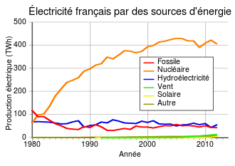

*Réponse publiée [sur Quora](https://fr.quora.com/La-France-poss%C3%A8de-de-nombreuse-centrales-nucl%C3%A9aires-mais-quelle-est-la-quantit%C3%A9-d%C3%A9nergie-produite-et-%C3%A0-quel-point-cela-est-important/answer/Dr-Goulu)*

L'[Industrie nucléaire en France](w:)couvre, en 2016, 72 % de la production française d'électricité, qui représente elle-même 27 % de la consommation finale d'énergie du pays. Le nucléaire produit environ 400 TWh / an

D'autre part, en 2018, les ménages français ont payé leur électricité 0,180 € TTC/kWh en moyenne, soit en dessous de la moyenne Européenne ( 0,211 € TTC/kWh ), et beaucoup moins que le Danemark (0,312 € TTC/kWh) ou l’Allemagne (0,300 € TTC/kWh) , champions de l'éolien.

[Comparaison du prix de l'électricité en France et en Europe](https://selectra.info/energie/guides/tarifs/electricite/comparaison-europe)
