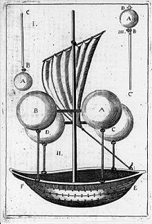

*Réponse publiée [sur Quora](https://fr.quora.com/O%C3%B9-est-l-erreur-des-fr%C3%A8res-Montgolfier-la-fum%C3%A9e-cr%C3%A9e-une-pression-ascendante-en-montant-L-exp%C3%A9rience-bas%C3%A9e-sur-la-combustion-fumig%C3%A8ne-de-paille-humide-confirme-la-th%C3%A9orie-Toute/answer/Dr-Goulu)*

sur [Frères Montgolfier — Wikipédia](w:Frères_Montgolfier) on lit :

> Le feu produit une épaisse fumée, car ils pensent, par analogie aux nuages, que la fumée est la responsable de l'élévation. (en citant Jean Anglade, Les Montgolfier, Perrin, 1990, p. 88. )

mais aussi :

> Plusieurs hypothèses existent sur la naissance de l'idée de l'utilisation de l'air chaud. Dans une version, Joseph ayant jeté un papier dans la cheminée s’aperçoit que ce dernier est aspiré. Dans une autre, l'idée lui vint simplement en voyant monter la fumée ou une chemise de sa femme dans la cheminée. Sur cette origine, les sources ne sont pas sûres.

et plus,loin, pour le **premier vol humain de l'histoire, le 15 octobre 1783**

> La méthode de chauffage change, la paille sèche est utilisée : elle produit moins de fumée mais est plus efficace. Pilâtre commence à bien manier le ballon, maniement qui consiste à alimenter le feu du foyer avec de la paille pour contrôler la montée ou la descente du ballon.

Donc les frères Montgolfier ont fait une hypothèse qu'ils ont très rapidement raffinée par l'expérience.

Il semblerait donc que les Montgolfier, papetiers et inventeurs plus que scientifiques, n'aient pas réalisé que leur ballon volait grâce à la [Poussée d'Archimède](w:), peut-être (je n'ai pas trouvé confirmation) parce qu'on ne savait pas que l'air chaud a une densité inférieure à l'air froid.

Pourtant, un siècle plus tôt, en 1670 [Francesco Lana de Terzi](w:) avait déjà imaginé un vaisseau volant grâce à la sur des sphères sous vide :

Donc pour finalement répondre à votre question, je dirais que l' interprétation phénoménologique d'un seul phénomène isolé doit en effet toujours être considérée suspecte. C'est la cohérence de multiples phénomènes divers et répétés avec des théories sans cesse raffinées et testées qui permet une interprétation si peu suspecte qu'on peut la qualifier de vérité scientifique. Toujours "jusqu'à preuve du contraire" …
