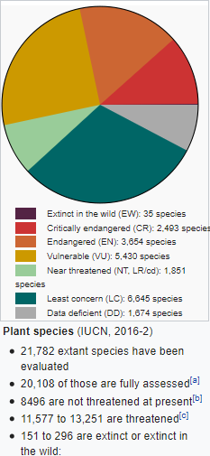

*Réponse publiée [sur Quora](https://fr.quora.com/Quelles-sont-les-esp%C3%A8ces-v%C3%A9g%C3%A9tales-qui-subissent-actuellement-une-extinction-massive/answer/Dr-Goulu)*

Une [Extinction massive](w:) est un événement relativement bref à l’[échelle des temps géologiques](w:) au cours duquel au moins 75 % des espèces animales et végétales présentes sur la Terre et dans les océans disparaissent. (définition Wikipédia)

> L'[Extinction de l'Holocène](w:) qui est clairement en cours n'est pas (encore) "massive" car si toutes les espèces « menacées » disparaissent dans les 100 prochaines années et que le taux d’extinction demeure constant, on s'attend à ce que les vertébrés atteignent ce seuil en environ 240 à 540 ans. Si toutes les espèces en « danger critique » disparaissent dans les 100 prochaines années, on s'attend à ce que ce seuil soit atteint en environ 890 à 2270 ans. Autrement dit, **on craint que des taux correspondant à une extinction massive soient éventuellement atteints, mais ce ne serait pas encore le cas**

Ceci dit, vous trouverez sur la Wikipédia anglophone des listes d'espèces de plantes classées par niveau de danger d'extinction de l'UICN :

- [List of extinct plants](w:en:List_of_extinct_plants)
- [List of least concern plants](w:en:List_of_least_concern_plants)
- [List of near threatened plants](w:en:List_of_near_threatened_plants)
- [List of vulnerable plants](w:en:List_of_vulnerable_plants)
- [List of endangered plants](w:en:List_of_endangered_plants)
- [List of critically endangered plants](w:en:List_of_critically_endangered_plants)
- [List of data deficient plants](w:en:List_of_data_deficient_plants)

Au total, sur 20'108 espèces de plantes dont le statut a été évalué, entre 11'577 et 13'251 , soit plus de la moitié sont menacées :

Il est très probable que de nombreuses espèces ont disparu avant qu'on les aie découvertes dans le passé récent en raison de la déforestation ou de l'agriculture.
