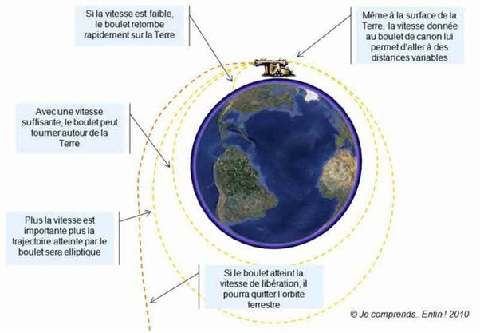

*Réponse publiée [sur Quora](https://fr.quora.com/Pourquoi-la-Terre-ne-tombe-t-elle-pas-sur-le-Soleil/answer/Dr-Goulu)*

Elle tombe, mais elle rate le soleil, alors elle retombe un peu plus loin et ainsi de suite.

C'est le principe de l'orbite expliquée par le [Canon de Newton](w:) : (remplacez la Terre par le Soleil, et le boulet par la Terr, c'est toujours le même principe)

