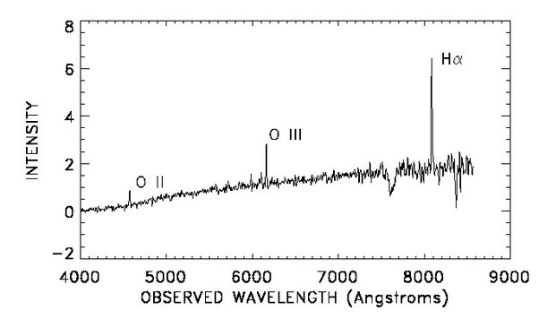

*Réponse publiée [sur Quora](https://fr.quora.com/Comment-faites-vous-la-distinction-entre-la-temp%C3%A9rature-et-leffet-Doppler-en-utilisant-le-rayonnement-de-corps-noir/answer/Dr-Goulu)*

L' [Effet Doppler relativiste](w:) décale le spectre de [Rayonnement du corps noir](w:) de la même manière qu'un décalage de température :

$T' = T \sqrt{\frac{c-v}{c+v}}$

En astrophysique, la distinction se fait en observant le décalage des raies d'émission ou d'absorption . Voici par exemple une partie du spectre réellement mesuré d'une galaxie :

(source [http://www.ifa.hawaii.edu/users/...](http://www.ifa.hawaii.edu/users/acowie/class05/home9_sol.html) )

On y voit très nettement le pic [Hα](w:) de l'Hydrogène et deux pics de l'oxygène. Sur la mesure, le pic de l'hydrogène est à 810 nm, alors que [Hα](w:) est à 656.3 nm au repos.

En faisant la moyenne des décalages des trois pics on trouve un [Décalage vers le rouge](w:) z=0.228 qui correspond à une vitesse d'éloignement de 68300 km/s, et par la [Loi de Hubble-Lemaître](w:) une distance de 1050 Mega[Parsec](w:), soit 3.4 milliards d'années lumière.

Je sais pas vous, mais moi ça me scotche littéralement de voir qu'on peut mesurer le spectre d'un objet si lointain avec autant de précision.

En passant, l'hypothèse de la [Lumière fatiguée](w:) a été écartée à partir de telles mesures, car elle prévoyait une déformation du spectre, donc un décalage différent des différentes raies.
