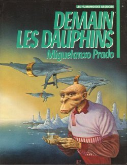

*Réponse publiée [sur Quora](https://fr.quora.com/Dapr%C3%A8s-vous-les-humains-vont-ils-dispara%C3%AEtre-un-jour-comme-les-dinosaures/answer/Dr-Goulu)*

Les [Dinosaures](w:Dinosauria) n'étaient pas une, mais des milliers d'espèces répartis sur presque 180 millions d'années. On ne peut pas les comparer à l'espèce humaine [Homo sapiens](w:) qui a 300'000 ans. Les autres espèces du genre [Homo](w:) ont vécu au maximum 700'000 ans, donc nous en avons pour encore quelques centaines de milliers d'années au mieux.

Pas besoin d'un événement catastrophique pour qu'une espèce disparaisse. Elle peut simplement perdre sa diversité génétique à la longue, ou au contraire se diviser en plusieurs espèces si elle essaime dans des environnements distincts.

La disparition d'Homo Sapiens que je souhaite est décrite dans une superbe BD:

