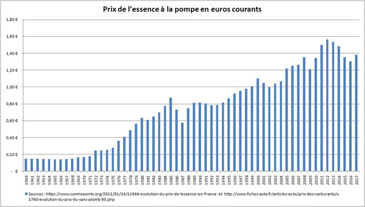
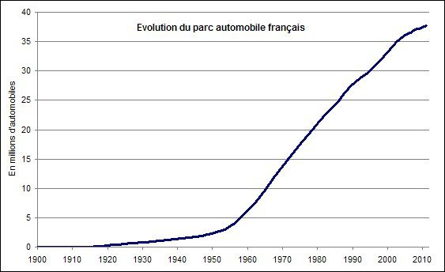

*Réponse publiée [sur Quora](https://fr.quora.com/Que-deviendront-toutes-les-voitures-une-fois-que-le-prix-du-carburant-aura-%C3%A9t%C3%A9-multipli%C3%A9-par-10/answer/Dr-Goulu)*

Regardez, et méditez :

Le prix du carburant a déjà été multiplié par presque 10 depuis 1960. Et voilà le nombre de voitures en France :

Cherchez l'erreur…

Donc pour répondre à votre question, les voitures qui consommaient 30 litres aux 100 km dans les années 1960 sont à la casse ou dans les musées
