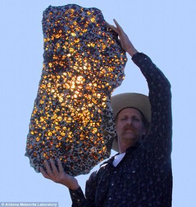

*Réponse publiée [sur Quora](https://fr.quora.com/Y-a-t-il-des-ast%C3%A9ro%C3%AFdes-trouv%C3%A9s-sur-terre-qui-sont-int%C3%A9ressants/answer/Dr-Goulu)*

Un astéroïde trouvé sur terre s'appelle une météorite. Elles sont toutes intéressantes, mais quelques unes sont extraordinaires:

Les [Météorite martienne](w:)s, éjectées de Mars par un impact de météorite là bas, et retombées sur la Terre

La plus grosse, la [Météorite d'Hoba](w:)

La plus belle, la [Météorite de Fukang](w:) :

