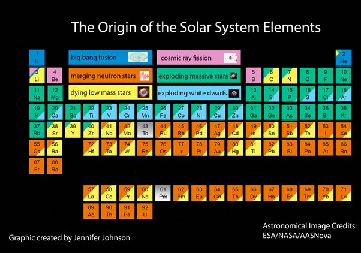

*Réponse publiée [sur Quora](https://fr.quora.com/On-dit-que-les-%C3%A9l%C3%A9ments-du-tableau-p%C3%A9riodique-se-cr%C3%A9ent-suite-%C3%A0-limplosion-dune-%C3%A9toile-Mais-%C3%A0-partir-de-quoi-se-forment-ils-sil-ny-en-a-pas-de-base/answer/Dr-Goulu)*

A partir des éléments fusionnés par l'étoile.

Les étoiles légères comme le Soleil fusionnent de l'hydrogène en hélium, puis éventuellement et [très brièvement](w:Flash_de_l'hélium) l'hélium en carbone. Quand elles s'éteignent elles produisent les éléments en jaune dans le graphique ci-dessous puis ceux en bleu ciel.

Les étoiles plus massives produisent des quantités énormes de [carbone-azote-oxygène](w:Cycle_carbone-azote-oxygène). Lorsqu'elles s'effondrent, ces étoiles massives fusionnent ces atomes entre eux et avec l'hydrogène et l'hélium et produisent les éléments en vert.

Voir [Nucléosynthèse stellaire — Wikipédia](w:Nucléosynthèse_stellaire) pour plus de détails.
