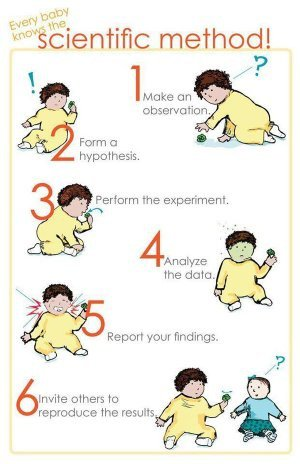

*Réponse publiée [sur Quora](https://fr.quora.com/Quelle-est-l-importance-des-hypoth%C3%A8ses-dans-la-recherche/answer/Dr-Goulu)*

C'est le point 2 de la méthode scientifique.

Indispensable, mais pas plus que les autres étapes.
