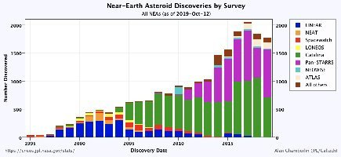

*Réponse publiée [sur Quora](https://fr.quora.com/Existe-til-une-probabilit%C3%A9-quon-rate-lobservation-dun-ast%C3%A9ro%C3%AFde-apocalyptique-et-quil-y-ait-un-impact-surprise/answer/Dr-Goulu)*

Oui, mais elle est faible, de plus en plus faible.

Les instruments comme [Pan-STARRS](w:)repèrent de moins en moins de nouveaux [Astéroïde géocroiseur](w:) et pratiquement plus de gros, d'un km et plus.

l'orbite des geocroiseurs dangereux est prévisible sur plus d'un siècle et la précision s'améliore en continu. Ces objets sont clairement les plus dangereux car ils croisent notre orbite toutes les X années.

Maintenant on est pas à l'abri de l'éjection d'un astéroïde de la ceinture par un caprice gravitationnel et qui nous arriverait pile dessus, mais c'est extraordinairement improbable.

[Risques météoritiques - Pourquoi Comment Combien](/2012/01/28/risques-meteoritiques/)
