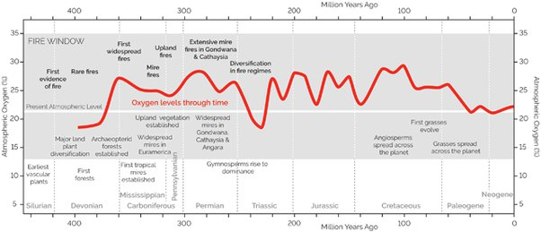
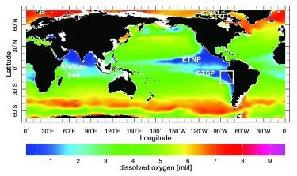

*Réponse publiée [sur Quora](https://fr.quora.com/Comment-se-fait-il-que-le-taux-doxyg%C3%A8ne-soit-le-m%C3%AAme-depuis-des-milliers-dann%C3%A9es-Est-ce-que-la-nature-sautor%C3%A9gule-entre-les-consommateurs-doxyg%C3%A8ne-et-les-producteurs-comme-certaines/answer/Dr-Goulu)*

Le taux d'oxygène n'est pas si stable que ça (des milliers d'années ce n'est rien du tout)

en plus il y a d'importantes variations locales, ici dans les océans :

Bref, l'oxygène est une des composantes d'un système dynamique très complexe, mais le [Cycle de l'oxygène](w:) est très lié à celui du Carbone, donc du vivant.

En sursimplifiant, la photosynthèse par les végétaux produit de l'oxygène, les animaux le respirent et bouffent des végétaux.
