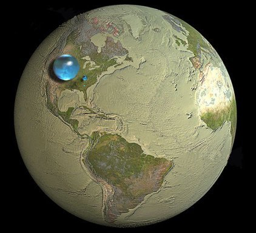

*Réponse publiée [sur Quora](https://fr.quora.com/Pourquoi-y-a-t-il-plus-d-eau-que-de-terre-sur-Terre/answer/Dr-Goulu)*

En êtes vous bien sur ?

La grosse boule bleue représente toute l'eau des océans à l'échelle de la Terre. (la petite est l'eau des glaciers, principalement polaire, et la encore plus petite à peine visible celle des lacs et cours d'eau douce)
