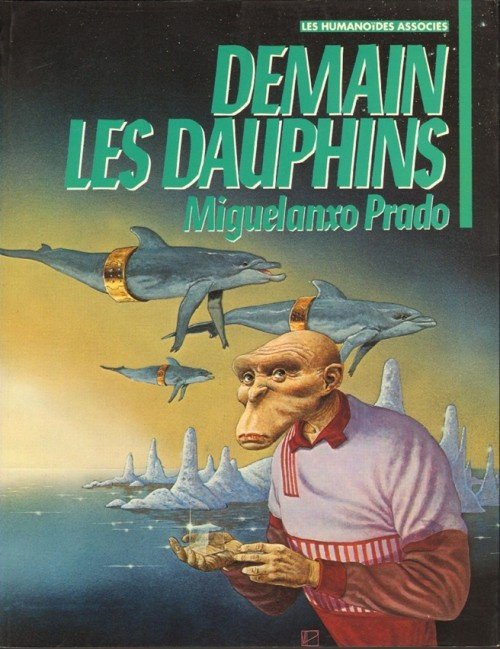

*Réponse publiée [sur Quora](https://fr.quora.com/Est-ce-que-un-nouveau-groupe-dHominid%C3%A9s-pourrait-remplacer-l-homo-sapiens-un-jour/answer/Dr-Goulu)*

Absolument, c'est même hautement probable.

Mais pour rappel, les [HominiDés](w:Hominidae) incluent [Homo sapiens](w:), mais aussi les "grands singes" : chimpanzés, bonobos, et plusieurs espèces de gorilles et d'orang-outans.

Je pars de l'idée que vous vouliez plutôt parler des [HominiNés](w:Hominina), dont le genre [Homo](w:) est le dernier survivant (en violet dans le graphique ci-dessous), et [Homo sapiens](w:) la dernière espèce de ce genre.

On voit dans ce graphique que les espèces d'Homo ont duré moins d'1 million d'années dans les meilleurs des cas (Habilis, Ergaster, Erectus), et que la dispersion géographique a permis à plusieurs espèces d'Homo de coexister.

Dans les ~500'000 ans qu'il reste statistiquement à notre espèce, il y aura soit:

1. effondrement de sociétés, plusieurs glaciations et re-dispersions géographique entraînant des adaptations locales qui pourraient former des espèces distinctes si elles durent longtemps
2. essaimage dans l'espace, donc dispersion géographique sur des distances astronomiques rendant impossible l'homogénéisation des gènes
3. modifications génétiques artificielles, hybridation , voire "[Téléchargement de l'esprit](w:)" dans des objets synthétiques voire un monde virtuel, donc nouvelle espèce artificielle.

Si vous vouliez vraiment parler des hominiDés, alors le scénario 1 pourrait sauver la peau des "grands singes" et leur permettre de générer de nouvelles espèces à eux, et le scénario 2 est celui de cette géniale BD :

