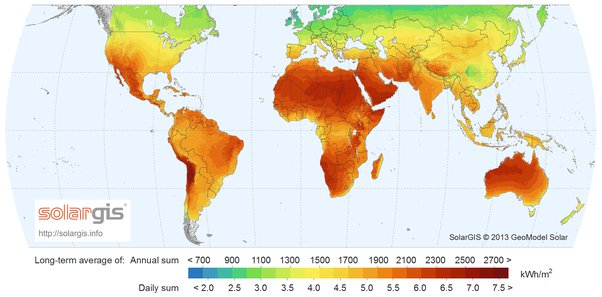

*Réponse publiée [sur Quora](https://fr.quora.com/Est-il-possible-que-l-%C3%A9nergie-solaire-soit-efficace-dans-les-pays-c%C3%B4tiers/answer/Dr-Goulu)*

[Irradiation solaire — Wikipédia](w:Irradiation_solaire)
