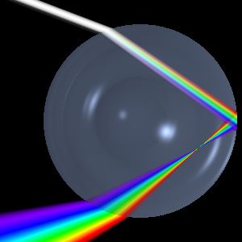

*Réponse publiée [sur Quora](https://fr.quora.com/Pourquoi-il-y-a-des-arcs-en-ciel/answer/Dr-Goulu)*

[Comment se forme un arc-en-ciel ?](https://kidiscience.cafe-sciences.org/articles/comment-se-forme-un-arc-en-ciel/) - KidiScience
