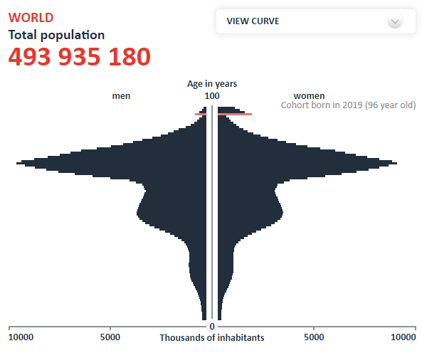

*Réponse publiée [sur Quora](https://fr.quora.com/Est-il-r%C3%A9aliste-de-r%C3%A9duire-la-population-mondiale-%C3%A0-500-millions-dhabitants-Ou-alors-le-graveur-des-Georgia-Guidestones-a-t-il-fait-une-faute-de-frappe/answer/Dr-Goulu)*

En jouant avec [le simulateur de population de l'INED](https://www.ined.fr/_modules/SimulateurPopulation/?lang=en), on voit que s'il n'y avait plus aucune naissance dès aujourd'hui, la population s'abaisserait à 500 millions en 2095. Le problème est qu'alors, la femme la plus jeune aurait 76, ans, pas évident pour maintenir la population…

Avec 0.5 enfants par femme (on tire à pile ou face celle qui a le droit d'avoir un enfant…) on arrive à 500'000 humains en 2115, mais une pyramide des âges qui ne laisse pas beaucoup d'espoir de toucher une retraite :

Si vous avez beaucoup plus de temps, ça devient un peu plus réaliste…
