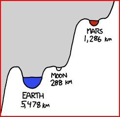

*Réponse publiée [sur Quora](https://fr.quora.com/Pourquoi-ne-cr%C3%A9ent-ils-pas-une-station-spatiale-semblable-%C3%A0-la-SSI-pour-observer-Mars-et-cr%C3%A9er-un-tremplin-vers-la-plan%C3%A8te-rouge/answer/Dr-Goulu)*

Parce que :

1. l'ISS tourne beaucoup trop vite et les stations spatiales sont trop "bruyantes" en vibrations pour y installer de bons télescopes. Pour observer Mars, on a des télescopes terrestres, spatiaux, et des sondes sur place.
2. l'ISS n'est même pas à un millième de la hauteur de Mars dans le puits gravitationnel. C'est l'équivalent des deux premières marches de l'escalier de la tour Eiffel…

Détails du [Génial dessin "gravity Wells" de XKCD](https://xkcd.com/681/) , avec [explications en français ici](/2012/09/05/un-petit-pas-pour-lhomme/)

