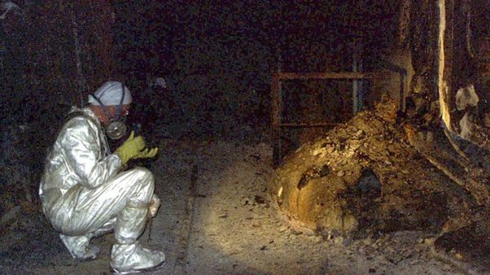

*Réponse publiée [sur Quora](https://fr.quora.com/%C3%80-quelle-distance-pouvez-vous-vous-rendre-au-pied-des-%C3%A9l%C3%A9phants-%C3%A0-Tchernobyl-avant-qu-il-ne-devienne-fatal/answer/Dr-Goulu)*

Tout près :

[L](w:Pied_d'éléphant_(Tchernobyl))e monsieur sur la photo juste à côté du [Pied d'éléphant](w:Pied_d'éléphant_(Tchernobyl)) est Artur Kornayev en 1996. Il a pris sa retraite en 2014.

La [Dose efficace](w:Dose_efficace_(radioprotection)) reçue dépend évidemment du rayonnement radioactif de la chose, mais aussi du temps d'exposition.
