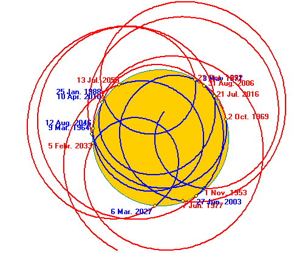

*Réponse publiée [sur Quora](https://fr.quora.com/Quel-est-le-centre-du-syst%C3%A8me-solaire/answer/Dr-Goulu)*

le [barycentre](w:Coordonnées_barycentriques_(astronomie))du système solaire bouge de manière assez importante avec le mouvement des planètes, notamment les plus massives, Jupiter et Saturne.

Il arrive même que le barycentre sorte du Soleil, ce qui est d'ailleurs le cas actuellement, depuis le 21 juillet 2016 jusqu'au 6 mars 2027 :

( source : [Solar System Center of Mass: case study](http://www.timingsolution.com/TS/Study/cm/) )

On peut aussi voir ceci comme une oscillation du Soleil autour de ce centre de masse, qui permettrait à des extraterrestres de découvrir nos planètes par la [Méthode des vitesses radiales — Wikipédia](w:Méthode_des_vitesses_radiales)
