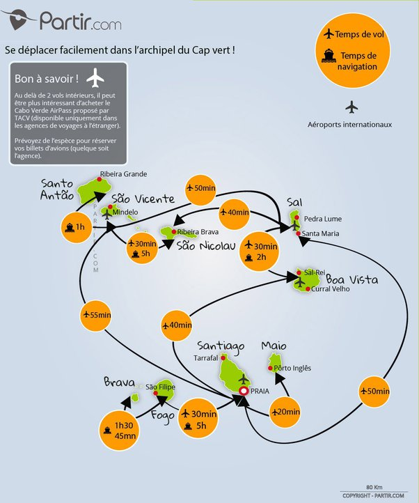

*Réponse publiée [sur Quora](https://fr.quora.com/Quelle-%C3%AEle-peut-on-visiter-pour-une-journ%C3%A9e-au-d%C3%A9part-de-l-%C3%AEle-de-Boa-Vista-au-Cap-Vert/answer/Dr-Goulu)*

D'après la carte ci-dessous, vous pourriez éventuellement aller pour la journée à Sal, mais ce serait une erreur. Ne vous dépêchez pas de visiter le Cap Vert. C'est un pays lent qui se visite lentement. Prenez votre temps. Au moins une semaine par île. [Santo Antão](w:Santo_Antão_(Cap-Vert)) est ma préférée.

