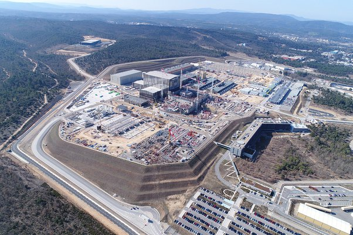
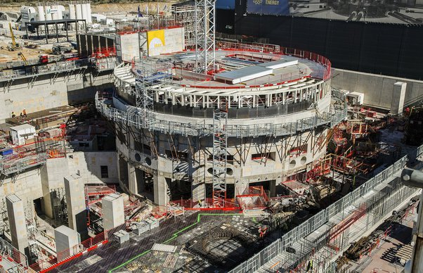
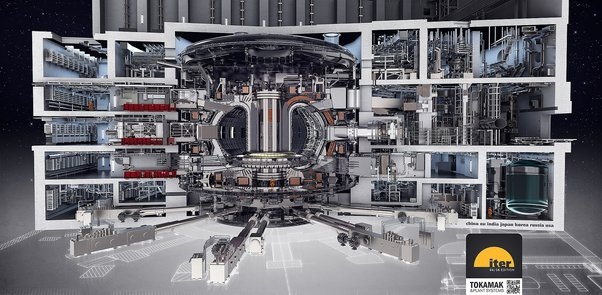

*Réponse publiée [sur Quora](https://fr.quora.com/Si-on-reproduisait-un-soleil-dun-diam%C3%A8tre-dun-kilom%C3%A8tre-en-laboratoire-serait-il-assez-puissant-pour-alimenter-en-%C3%A9nergie-gratuite-la-plan%C3%A8te-au-complet/answer/Dr-Goulu)*

Gratuite, certainement pas. Les gens qui auraient développé ce truc voudraient au minimum gagner leur vie, et si possible au moins aussi bien que des cheikhs du pétrole. Et puis il faudrait amener cette énergie chez vous, et les gens qui construisent les lignes veulent aussi être payés etc. Bref, on vous vendra cette énergie au prix maximisant le profit, exactement comme maintenant.

Car réalisez bien que vous ne payez pas le pétrole. Le pétrole au fond d'un puits ne coûte strictement rien. Vous payez uniquement les gens qui l'extraient, le transforment, le transportent, le stockent, et des tas de fonctionnaires via les taxes.

Pour en revenir à votre Soleil artificiel, le problème est que la [Fusion nucléaire](w:) ne marche pas en petit. Il faut une étoile. Ou alors, c'est TRES compliqué[[1]](#wtcdf) .

Le projet [ITER](w:) est en train de construire un réacteur qui devrait produire de l'énergie comme ça.

Le site ne fait pas loin d'un km :

Le réacteur proprement dit sera dans ce bâtiment qui doit bien faire 50m de diamètre (ya des gens, si vous regardez à la loupe…)

Et l'intérieur sera comme ça:

La partie torique au centre contiendra 840 m3 de plasma de deuterium et tritium (des isotopes de l'hydrogène).

Si ça marche, il produira 500 MW environ, mais en consommera à peu près autant pour fonctionner …

Ensuite, il y aura [Demo](w:Demo_(réacteur)), d'une puissance de 2000 MW.

Il en faudrait environ 1500 pour fournir l'énergie que nous consommons actuellement sur la planète.

Ca ne sera pas demain, et absolument pas gratuit.

Notes de bas de page

[[1]](#cite-wtcdf)[la fusion thermonucléaire - Pourquoi Comment Combien](/2005/12/11/la-fusion-thermonucleaire/)
