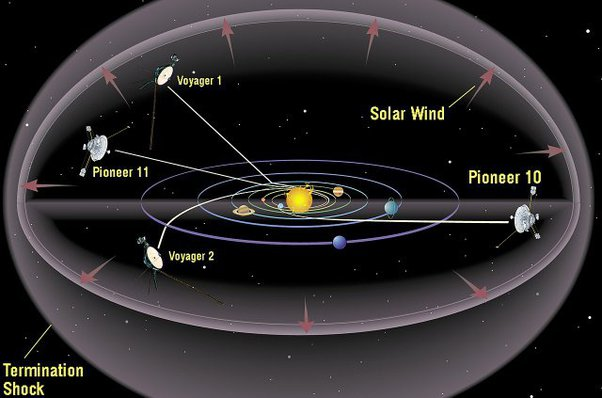

*Réponse publiée [sur Quora](https://fr.quora.com/Comment-se-fait-il-que-Voyager-2-a-pu-rejoindre-voyager-1-dans-l-espace-interstellaire/answer/Dr-Goulu)*

Les deux sondes ne se sont pas rejoint, elles suivent des trajectoires très différentes

