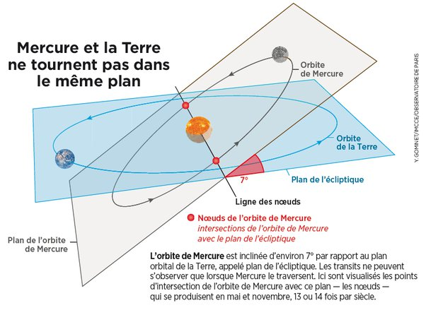

*Réponse publiée [sur Quora](https://fr.quora.com/Pourquoi-le-passage-de-Mercure-devant-le-soleil-est-il-si-rare/answer/Dr-Goulu)*

Le plan de l'orbite de Mercure est incliné de 7° par rapport à la Terre.

Comme le diamètre apparent du Soleil est d'environ 1/2 degré, on ne peut voir un [Transit de Mercure](w:) que lorsque les deux planètes sont presque alignées sur la "ligne des noeuds" à l'intersection des deux plans.

[Transit de Mercure du 9 mai 2016 : pourquoi ce phénomène est-il rare ?](https://www.sciencesetavenir.fr/espace/planetes/transit-de-mercure-du-9-mai-2016-pourquoi-ce-phenomene-est-il-rare_23513)
