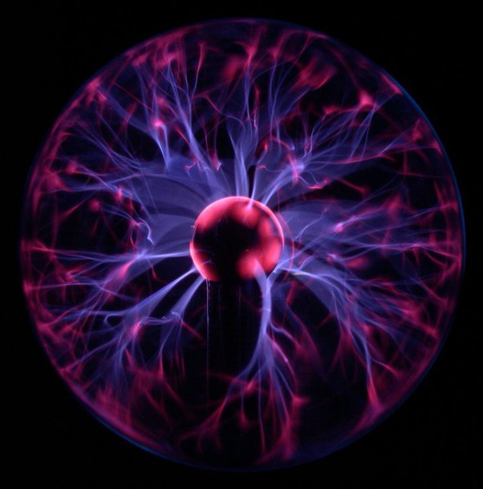

*Réponse publiée [sur Quora](https://fr.quora.com/Pourquoi-le-Plasma-est-il-consid%C3%A9r%C3%A9-comme-un-quatri%C3%A8me-%C3%A9tat-de-la-mati%C3%A8re-qui-n-a-lieu-que-dans-les-%C3%A9toiles-Quelle-est-l-%C3%A9tranget%C3%A9-du-comportement-de-la-mati%C3%A8re-dans-cet-%C3%A9tat/answer/Dr-Goulu)*

Pas que dans les étoiles. Le [plasma](w:État_plasma) est facilement produit sur Terre dans des flammes haute température et des lampes, et même des gadgets comme celui ci:

L'état plasma se caractérise par le fait que la matière est fortement ionisée, les noyaux atomiques flottant dans un gaz d'électrons. Les plasma sont donc conducteurs d'électricité.
