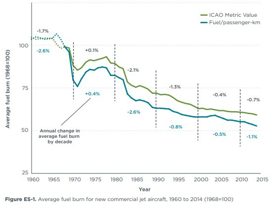
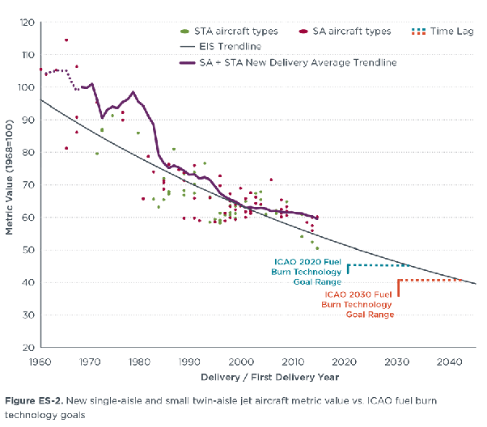
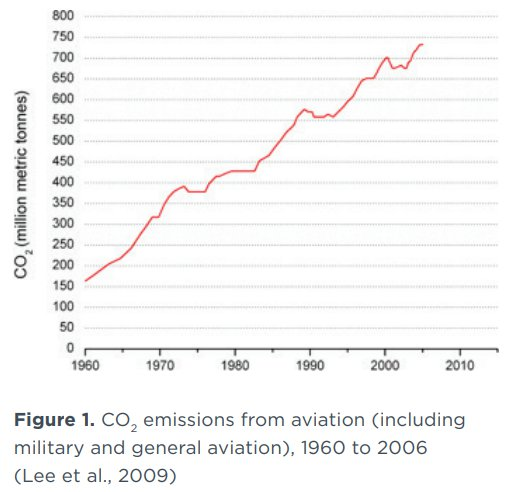

*Réponse publiée [sur Quora](https://fr.quora.com/Un-avion-qui-est-propre-consomme-t-il-moins-de-carburant-quun-avion-qui-est-sale-Meilleur-coefficient-Cx/answer/Dr-Goulu)*

Oui.

Non, meilleurs réacteurs et avions plus gros.

Cette figure tirée de ce très intéressant rapport[[1]](#LIvFd) montre que la consommation des avions par passager a baissé d'environ 50% depuis 1968 :

Celle-ci montre les valeurs atteintes par les différents modèles de moyen courrier avec les objectifs 2020 et 2030 :

Avec ceci on pourrait se demander pourquoi les émissions de CO2 de l'aviation ont fait ça :

C'est à cause du [Postulat de Khazzoom-Brookes](w:) : l'augmentation de l'efficacité écologique des avions provoque une baisse des coûts qui va jusqu'à concurrencer le train…, ce qui permet à plus de clients de voler plus souvent, et provoque une augmentation de la consommation et de la pollution nettement plus élevée que l'économie réalisée par chaque avion …

L'augmentation de l'efficacité écologique entraîne une augmentation de la pollution … Méditez ça …

Notes de bas de page

[[1]](#cite-LIvFd)[https://theicct.org/sites/defaul...](https://theicct.org/sites/default/files/publications/ICCT_Aircraft-FE-Trends_20150902.pdf)
