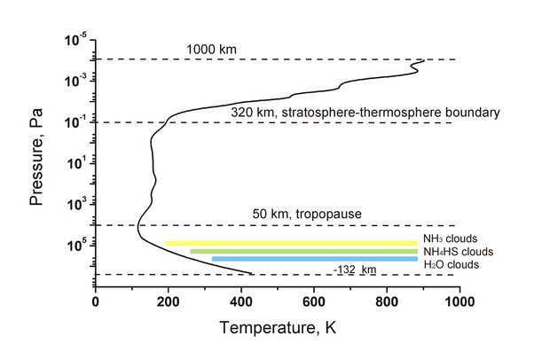
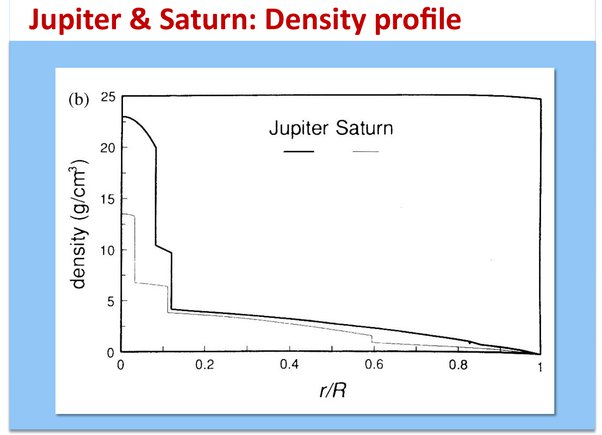

*Réponse publiée [sur Quora](https://fr.quora.com/%C3%80-quelle-point-une-sonde-devrait-%C3%AAtre-solide-pour-ne-pas-%C3%AAtre-d%C3%A9truite-sur-Jupiter/answer/Dr-Goulu)*

La [Sonde atmosphérique de la sonde Galileo](w:Galileo_(sonde_spatiale))a pénétré l'atmosphère de Jupiter le 7 décembre 1995. Elle fut freinée par un parachute sur 150 km d'atmosphère, collectant des données pendant 57,6 minutes avant d'être écrasée par la pression (22 fois la pression habituelle sur Terre, à une température de 153 °C) à 132 km sous la surface définie par une pression de 1 bar.

La structure de l'[Atmosphère de Jupiter](w:) mesurée est celle-ci :

On voit que pour descendre plus bas, il faudrait résister à de plus hautes pressions, et on sait faire des bathyscaphes qui tiennent 1000 bars.

Pour la température, c'est plus délicat car il n'y a aucun moyen de refroidir durablement un corps plongé dans un fluide plus chaud. Donc il faut descendre le plus vite possible, ce qui nous amène au troisième problème : la densité.

La densité de Jupiter augment tout de même "vite" avec la profondeur, ce qui va générer une poussée d'Archimède croissante sur la sonde pendant qu'elle "coule" dans l'atmosphère.

Bref je verrais bien une boule d'Uranium préalablement refroidie vers 0K, avec juste quelques instruments et un émetteur alimentés par un thermocouple entre la surface et le centre de la sphère…

