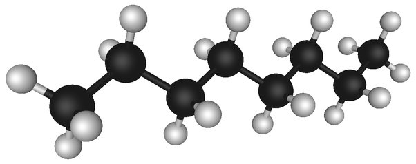

*Réponse publiée [sur Quora](https://fr.quora.com/Est-il-possible-dans-un-futur-proche-ou-lointain-de-cr%C3%A9er-de-leau-Est-ce-quil-est-d%C3%A9j%C3%A0-possible-de-cr%C3%A9er-de-leau-Merci-pour-vos-r%C3%A9ponses/answer/Dr-Goulu)*

"Créer" n'est pas le bon mot. En chimie on "synthétise" des molécules, et pour l'eau c'est hyper facile : il suffit de brûler de l'hydrogène.

Voici une machine à synthétiser de l’eau en pleine action :

de nombreux [Moteur-fusée](w:Moteur-fusée_à_ergols_liquides) utilisent de l’hydrogène liquide comme combustible et de l'oxygène liquide comme comburant. En brûlant ils forment de la vapeur d’eau si chaude qu’elle est lumineuse, et sous une pression telle qu’elle s’échappe par les tuyères à haute vitesse, propulsant la fusée.

Quand cette vapeur refroidit au contact de l’air elle forme une fumée blanche qui n’est composée que de gouttelettes d’eau.

Autrement dit : l’eau est de la cendre d’hydrogène.

Quand vous brûlez de l'essence dans votre moteur aussi, vous produisez de l'eau. L'essence est un [Hydrocarbure](w:), une chaine d'atomes de Carbone avec de l'hydrogène autour : Voici une molécule d'octane, avec 8 atomes de Carbone (en noir) et 18 atomes d'Hydrogène (en blanc)

Quand elle brûle dans votre moteur, elle se combine avec l'oxygène de l'air pour produire:

- 8 molécules de CO2
- 9 molécules de H2O : de l'eau !

Déjà vu des gouttes tomber d'un pot d'échappement quand il fait froid ? C'est l'eau produite par votre moteur.
