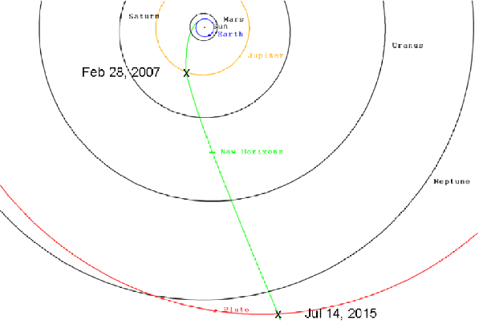
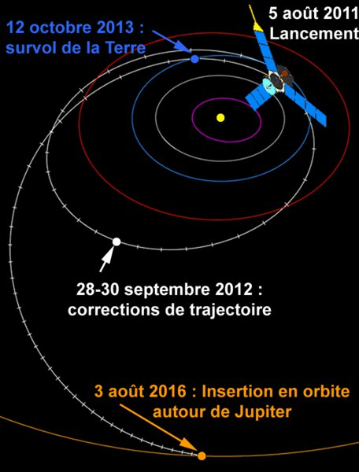

*Réponse publiée [sur Quora](https://fr.quora.com/Combien-de-temps-cela-nous-prendrait-il-pour-aller-sur-Jupiter/answer/Dr-Goulu)*

Si vous regardez les 9 sondes d'[Exploration du système jovien](w:), vous verrez que :

- pour passer à côté très vite et profiter de l'assistance gravitationnelle pour aller encore plus loin , le voyage dure une grosse année. Voici la trajectoire de [New Horizons](w:) lancé le 19 janvier 2006 :

- pour se mettre en orbite, c'est beaucoup plus long, de l'ordre de 5 ans. Voici la trajectoire de [Juno](w:Juno_(sonde_spatiale)) : remarquez comme elle est différente.

Donc quand vous dites que vous voulez aller "sur" Jupiter, tout dépend si vous voulez admirer le paysage ou vous vaporiser dans son atmosphère à une vitesse de météore.
