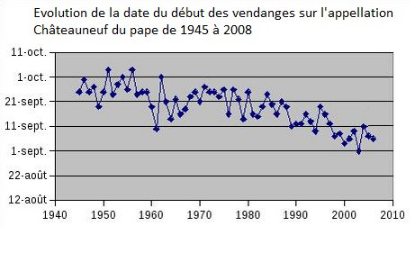

*Réponse publiée [sur Quora](https://fr.quora.com/Comment-d%C3%A9montrer-ais%C3%A9ment-prouver-qu-il-y-a-un-R%C3%89EL-r%C3%A9chauffement-climatique/answer/Dr-Goulu)*

Le nombre de mesures cohérentes qui le montrent sur toute la planète est énorme.

En voici une toute simple : la date des vendanges de Châteauneuf-du-Pape

Source : [Le réchauffement climatique et le vin | Vins du monde](https://vinsdumonde.blog/le-rechauffement-climatique-et-le-vin/)
