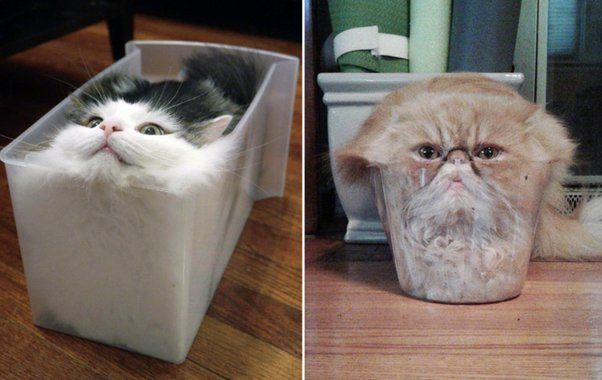

*Réponse publiée [sur Quora](https://fr.quora.com/Le-chat-est-il-un-liquide-ou-un-solide/answer/Dr-Goulu)*

Comme brillamment démontré dans cet article

Marc-Antoine Fardin “[On the rheology of cats](https://www.drgoulu.com/wp-content/uploads/2017/09/Rheology-of-cats.pdf)” *Rheology Bulletin*, vol. 83, 2, July 2014, pp. 16-17 and 30.

récompensé par un prix IgNobel 2017, les chats sont un fluide rhéologique non linéaire.

