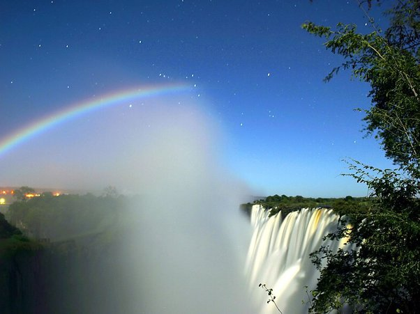

*Réponse publiée [sur Quora](https://fr.quora.com/Quels-facteurs-rendent-possible-un-arc-en-ciel-nocturne/answer/Dr-Goulu)*

Ca s'appelle un [Arc-en-ciel lunaire](w:) et c'est très joli, surtout en photo à longue pose:

Photo courtesy [Calvin Bradshaw](http://calvinbradshaw.com): Lunar Rainbow taken from the Zambia side of Victoria Falls. The constellation Orion is visible behind the top of the moonbow. (30 Sec exposure, taken from the Zambia side of the Falls)
