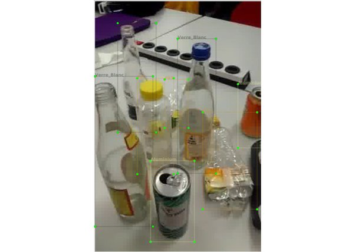
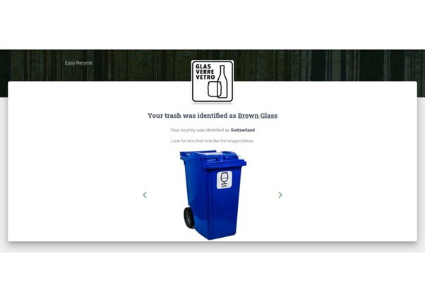

*Réponse publiée [sur Quora](https://fr.quora.com/Tr%C3%A8s-peu-de-Fran%C3%A7ais-connaissent-les-r%C3%A8gles-pr%C3%A9cises-du-tri-s%C3%A9lectif-qui-sont-compliqu%C3%A9es-et-changent-avec-le-temps-et-les-r%C3%A9gions-Avez-vous-une-suggestion-pour-le-rendre-plus-simple/answer/Dr-Goulu)*

au [LauzHack 2019](https://lauzhack.com/) j'ai vu un projet très intéressant : [EasyRecycle](https://devpost.com/software/easyrecycle-nzh3s4)

C'est une application pour smartphone qui identifie des déchets filmés:

et ensuite indique à quoi ressemble la poubelle adéquate pour chacun, en fonction de votre géolocalisation :

je trouve que c'est une idée à creuser …
