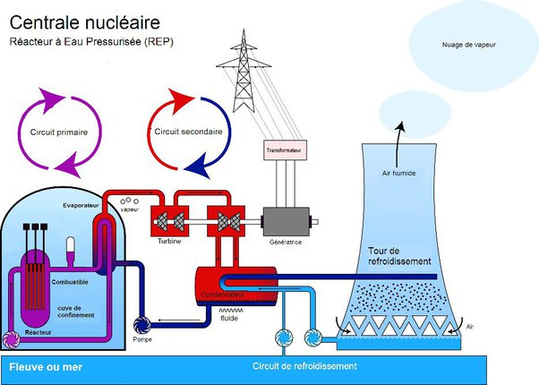

*Réponse publiée [sur Quora](https://fr.quora.com/La-fum%C3%A9e-de-centrales-nucl%C3%A9aires-est-elle-dangereuse/answer/Dr-Goulu)*

Si c'est vraiment de la fumée comme à Tchernobyl, oui.

Si vous pensez aux nuages blancs au dessus des tours de refroidissement, c'est de l'eau qui n'a jamais été en contact avec des substances radioactives, donc non.

