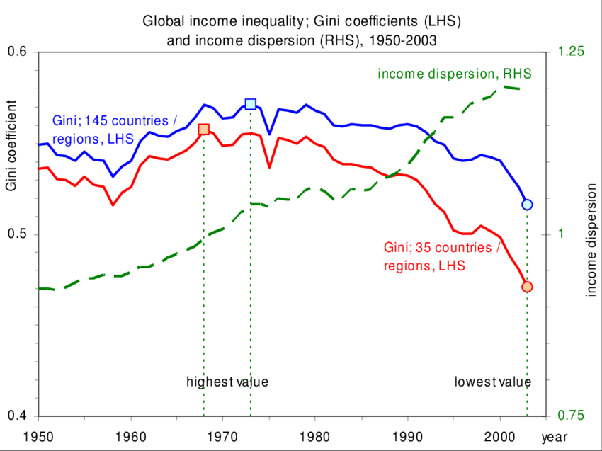

*Réponse publiée [sur Quora](https://fr.quora.com/Quel-exemple-donneriez-vous-pour-illustrer-les-in%C3%A9galit%C3%A9s-de-richesses/answer/Dr-Goulu)*

Je m'étais intéressé à la mesure des inégalités à l'occasion de l'[Initiative populaire « 1:12 - Pour des salaires équitables »](w:) sur laquelle nous avions voté en Suisse.

J'avais découvert que les "exemples" ou les mesures basées sur la comparaison de tranches de la population comme le rapport interdécile D9/D1 qui comparent le revenu des 10% les plus riches au 10% les plus pauvres sont mauvais, car ils ignorent les 80% de la population qui est entre deux.

La moins mauvaise manière de mesurer les inégalités est le [Coefficient de Gini](w:), qui tient compte de toute la population. C'est cette mesure qui est utilisée dans les comparaisons internationales comme celles de l'OCDE par exemple.

J'ai fait un [Calculateur d'(in)égalité](/2009/10/11/calculateur-dinegalite/#.Xe6VmuhsOCo) avec explications permettant de le calculer, par exemple pour une entreprise, mais il n'est hélas pas encore courant de "benchmarker" les salaires ainsi.

Je l'avais appliqué aux seule salaires que j'avais pu trouver en ligne, ceux des joueurs de tennis de l'ATP. Résultat : ils sont encore plus inégaux que le Mexique, cancre de l'OCDE.[[1]](#cWzeB) Pourtant on ne proteste pas contre les revenus mirobolants des sportifs mais contre ceux de directeurs dont dépendent des milliers d'emploi …

J'avais aussi découvert qu'il est (était…) difficile de généraliser la tendance à la hausse des inégalités car les coefficients de Gini nationaux varient assez vite[[2]](#nFFIa) , notamment en fonction du chômage, cause d'inégalités bien plus importantes que les hauts salaires.

Mais puisque la question concerne **un exemple**, je vais en donner un très contre-intuitif : l'augmentation de l'inégalité dans de nombreux pays n'empêche pas une **réduction des inégalités mondiales** !

(source : [https://www.researchgate.net/pub...](https://www.researchgate.net/publication/46512961_It's_a_Big_World_After_All_On_the_Economic_Impact_of_Location_and_Distance) )

C'est Hans Rosling qui explique ceci en montrant que le fossé entre les pays développés et l'ex "Tiers-Monde" s'est comblé par le développement économique des [BRICS](w:):

[https://youtu.be/yAP09ITNWN4](https://youtu.be/yAP09ITNWN4)

Notes de bas de page

[[1]](#cite-cWzeB)[1:12, le prix du talent - Pourquoi Comment Combien](/2013/10/26/112-le-prix-du-talent/#.Xe6VbehsOCo)

[[2]](#cite-nFFIa)[Combien d'inégalité ? - Pourquoi Comment Combien](/2009/03/21/combien-dinegalite/#.Xe6ZFuhsOCo)
