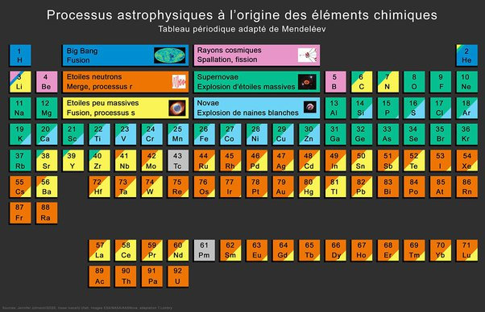

*Réponse publiée [sur Quora](https://fr.quora.com/Est-il-possible-que-lor-soit-dorigine-extraterrestre/answer/Dr-Goulu)*

Toute la matière de notre planète est par définition d'origine extraterrestre, puisque notre planète ne produit pas de matière par fusion thermonucléaire.

L'or ne fait pas exception, ce n'est d'ailleurs pas une matière plus extraordinaire ni plus rare que d'autres métaux lourds.

On pensait que l'or était produit par [Processus r](w:) dans certaines supernova, mais aujourd'hui on penche plus pour la [Fusion d'étoiles à neutrons](w:).

Ce tableau montre l'origine extraterrestre de tous les éléments chimiques :

