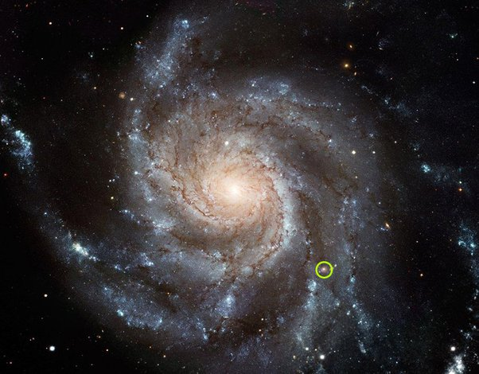

*Réponse publiée [sur Quora](https://fr.quora.com/Quelles-sont-les-constellations-de-la-Voie-Lact%C3%A9e/answer/Dr-Goulu)*

toutes.

Voici une image de (synthèse de ce à quoi ressemble) la Voie Lactée.

Si le Soleil est au centre du rond vert, toutes les étoiles du ciel qu'on voit à l’œil nu la nuit sont dans le cercle.

On a nommé environ [88 constellations](w:Liste_des_constellations) alors qu'on ne voit même pas un millième des étoiles de la Voie Lactée. Y'a pas assez de mots dans le dictionnaire pour nommer toutes les constellations qu'on pourrait trouver dans la Galaxie.

D'ailleurs maintenant qu'on en parle je distingue nettement la constellation du bombardier, celle des raviolis et celle du tire-bouchon…
