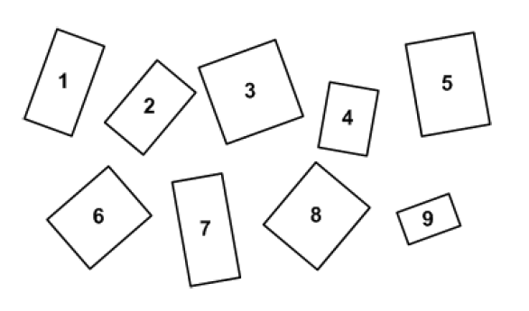

*Réponse publiée [sur Quora](https://fr.quora.com/Le-nombre-d-or-a-t-il-r%C3%A9ellement-des-propri%C3%A9t%C3%A9s-esth%C3%A9tiques/answer/Dr-Goulu)*

Faites le test vous-même :

Quels sont les rectangles les plus "esthétiques" ?

Solution dans [Nombre d'or et abeilles - Pourquoi Comment Combien](/2016/07/03/nombre-dor-et-abeilles/)
