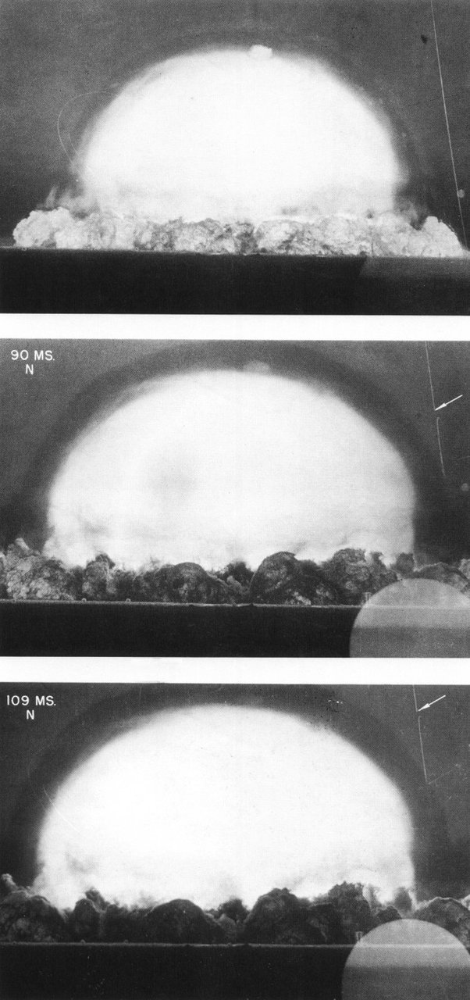
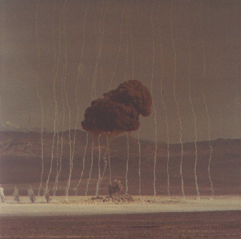

*Réponse publiée [sur Quora](https://fr.quora.com/A-quoi-correspondent-les-petites-colonnes-de-fum%C3%A9es-juste-apr%C3%A8s-une-explosion-nucl%C3%A9aire/answer/Dr-Goulu)*

Merci pour cette très intéressante question (= une dont je ne connaissais pas la réponse…).

J'ai trouvé la réponse sur [What are Those Smoke Trails Doing in That Test Picture?](https://www.nuclearweaponarchive.org/Usa/Tests/SmokeTrails.html) de [Carey Sublette](https://www.quora.com/profile/Carey-Sublette) que je me permets de traduire ici intégralement :

Dans les premières millisecondes d'une explosion nucléaire dans l'atmosphère, la boule de feu et l'onde de choc de l'explosion qui s'étendent rapidement ne font qu'un. La surface de la boule de feu en expansion est en fait l'avant de l'onde de choc.

Une fois la boule de feu refroidie à 300 000 degrés C (soit 15 millisecondes après la détonation pour une explosion de 20 kt), le front de choc et la boule de feu se séparent - un phénomène appelé "breakaway". Après ce moment, le front de l'onde de choc devient rapidement invisible car il perd de sa force et ne rend plus l'air incandescent par compression.

Il est donc difficile d'enregistrer la progression du front de choc. Les manomètres à choc peuvent être utilisés, mais ils sont difficiles à déployer ailleurs que près du sol où les interactions entre l'onde de choc et la surface compliquent leur interprétation.

Une solution à ce problème a été suggérée par une observation fortuite lors du tout premier essai nucléaire, Trinity le 16 juillet 1945. Berlyn Brixner a photographié le câble du ballon de barrage (la ligne blanche verticale sur le bord droit de l'image) derrière la boule de feu qui était visible en raison de la fumée produite par la vaporisation du câble :

Lorsque le front de choc est passé devant le câble, qui était à l'arrière-plan, une rupture apparente est apparue dans le câble - une illusion d'optique causée par la réfraction de la lumière par l'air comprimé derrière le front de choc. La flèche dans les deuxième et troisième images montre le mouvement de cette rupture, qui coïncide avec l'emplacement du front de choc.

Plusieurs années plus tard, ce phénomène a été mis à profit à l'aide de **roquettes fumigènes lancées depuis le sol quelques secondes avant la détonation**. Cela créé un réseau vertical de lignes de référence par rapport auxquelles la progression du front de choc a pu être photographiée.

Notez que ce n'est pas l'interaction directe réelle de l'onde de choc entrant en collision avec la fumée qui est impliquée ici.

La première photo que j'aie où la fumée des fusées est visible est ["Tumbler-Snapper Able](https://www.nuclearweaponarchive.org/Usa/Tests/Tumblers.html#Able) du 1er Avril 1952.

( d'autres photos sont disponibles sur la page [What are Those Smoke Trails Doing in That Test Picture?](https://www.nuclearweaponarchive.org/Usa/Tests/SmokeTrails.html) )
