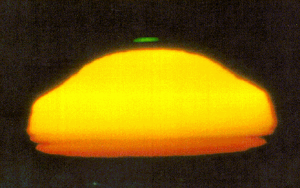
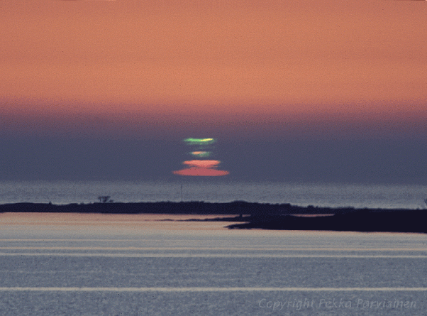

*Réponse publiée [sur Quora](https://fr.quora.com/Le-rayon-vert-existe-t-il-vraiment/answer/Dr-Goulu)*

oui! Le [Rayon vert](w:)est un phénomène optique rare qui se produit au coucher du Soleil sur la mer, par temps calme : une lueur verte apparaît au dessus du Soleil et reste visible après que le disque solaire soit passé derrière l’horizon.

On peut en trouver quelques photos sur le net, souvent de mauvaise qualité car comme le phénomène est imprévisible, il est rarement pris avec le télescope de rigueur, mais voici les meilleures que j'avais trouvées en 2007[[1]](#lDqxH)

On en trouve quelques unes de plus [sur Flickr en cherchant “green flash sunset”.](http://www.flickr.com/search/?q=green+flash+sunset)

Notes de bas de page

[[1]](#cite-lDqxH)[Le rayon vert - Pourquoi Comment Combien](/2007/05/28/le-rayon-vert/#.XffNuehsOCo)
