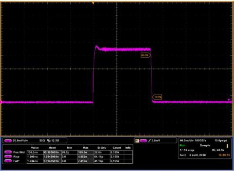

*Réponse publiée [sur Quora](https://fr.quora.com/Comment-une-onde-carr%C3%A9e-est-elle-g%C3%A9n%C3%A9r%C3%A9e/answer/Dr-Goulu)*

Aucun [signal carré](w:) ne peut être parfait, car aucun système physique ne peut commuter instantanément entre deux états : il y a toujours un temps de montée et souvent un "overshoot" du à une forme d'inertie:

(impulsion de laser, source [Shaper : driver de diode laser | Alphanov](https://www.alphanov.com/produits-services/driver-de-diode-laser) )

Le [Phénomène de Gibbs](w:) établit que ceci est très fondamental, et lié à la causalité : un signal parfaitement carré nécessite que "quelque chose" se produise avant même le flanc de l'impulsion.

Si vous acceptez les imperfections du signal, et vous n'avez pas d'autre choix que de les accepter, tout ce qu'il vous faut est un système qui a deux états stables, et assez de puissance pour le faire passer le plus vite possible entre les deux états.

En électronique, ce bon vieux [NE555](w:) permet d'obtenir un bon rapport carré/prix …
