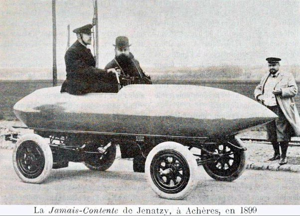

*Réponse publiée [sur Quora](https://fr.quora.com/Pourquoi-le-moteur-%C3%A0-combustion-a-t-il-pr%C3%A9valu-sur-le-moteur-%C3%A9lectrique-au-d%C3%A9but-de-la-voiture/answer/Dr-Goulu)*

C'est une excellente question.

Parce que les gens ne le savent pas, mais :

- En fait, au début de la voiture ce sont les moteurs électriques et à vapeur qui prévalaient sur les moteurs à combustion:

> En 1900, sur 4192 véhicules fabriqués aux [États-Unis](w:), 1575 sont électriques, 936 à essence et 1681 à vapeur. ([Voiture électrique — Wikipédia](w:Voiture_électrique) )

- la première voiture à avoir atteint 100 km/h était électrique : [La Jamais contente](w:), en 1899:

(vous imaginez ? 100 km/h là dedans ? ou plutôt là dessus ? la jugulaire pour tenir la casquette est indispensable….)

Les raisons qui ont conduit à l'adoption massive des voitures à essence sont encore débattues par les historiens ( voir [l'article Wikipédia](w:Voiture_électrique) pour détails et références), mais les questions d'aujourd'hui étaient encore plus d'actualité avec les batteries de l'époque : autonomie et temps de recharge …

Lors d'un cours sur l'innovation j'avais du défendre l'idée que les voitures électriques avaient eu leur chance, et l'avaient perdue... Je reste persuadé que les batteries solides solidaires du chassis sont une mauvaise idée. Ca va obliger à développer un colossal réseau de distribution d'électricité.

Deux alternatives me semblent dignes d'intérêt:

- les batteries amovibles qu'on remplace par des chargées dans des stations services en quelques minutes
- les batteries à flux redox, qui utilisent des électrolytes liquides qu'on peut remplacer dans les stations services en quelques minutes.
( voir [Des batteries redox qui se rechargent à la pompe...](https://www.futura-sciences.com/planete/actualites/developpement-durable-batteries-redox-rechargent-pompe-20862/) )
