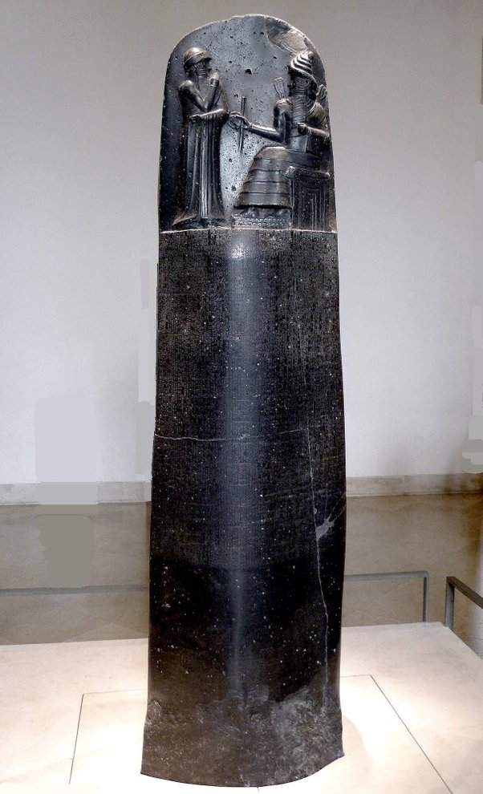

*Réponse publiée [sur Quora](https://fr.quora.com/Quels-sont-les-exemples-montrant-que-la-M%C3%A9sopotamie-abritait-l-un-des-plus-anciens-%C3%89tats-du-monde-hautement-d%C3%A9velopp%C3%A9-et-socialement-complexe/answer/Dr-Goulu)*

Le [Code de Hammurabi](w:), une colonne contenant plus de 200 articles de loi gravées dans du basalte autour de 1750 avant JC. Extraordinaire.

détail :

