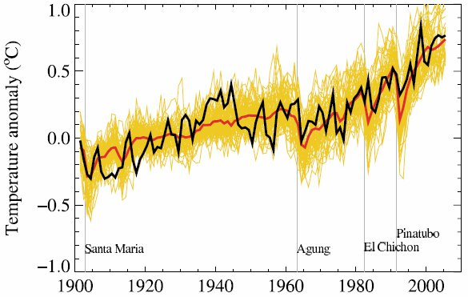
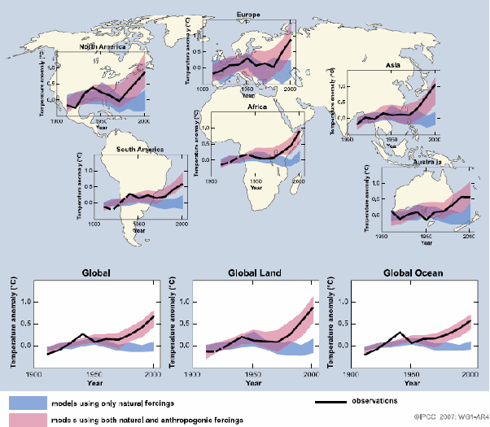

*Réponse publiée [sur Quora](https://fr.quora.com/Quelles-sont-les-hypoth%C3%A8ses-de-calcul-du-GIEC-concernant-le-r%C3%A9chauffement-climatique-caus%C3%A9-par-le-CO2/answer/Dr-Goulu)*

Le [Groupe d'experts intergouvernemental sur l'évolution du climat](w:) ne fait pas d'hypothèses de calcul. En fait il ne fait même pas de calculs ni même de recherche scientifique. Conformément à sa mission il synthétise les résultats de toutes les recherches scientifiques sur le climat.

Les climatologues ont développé des dizaines de [Modèle climatique](w:) distincts, de plus en plus precis avec le progrès des connaissances et des moyens informatiques.

Une [Identification de système](w:) permet d' obtenir automatiquement les paramètres numériques qui correspondent le mieux (habituellement au sens des moindres carrés) à des valeurs sorties / entrées connues. En passant, l'identification permet de distinguer les paramètres significatifs des non significatifs, donc d'écarter les "hypothèses de calcul" qui n'ont pas d'influence sur le résultat.

pour valider les modèles, l'astuce est de réaliser l'identification ci-dessus avec une partie des données seulement, en l'occurrence avec les données datant d'avant 1900, puis on compare les résultats prédits par les modèles pour la période moderne. Voici ce que ça donne pour les 58 modèles utilisés par le GIEC en 2007 (en jaune, leur moyenne en rouge et la température réellement mesurée en noir) :

On voit que les modèles suivent bien les mesures, et réagissent notamment aux éruptions volcaniques.

Ensuite on peut s'amuser à utiliser les mêmes modèles, identifiés et validés de la même manière, mais en négligeant les émissions humaines. Ça donne ça :

Les modèles identifiés (presque) sans CO2 anthropique (avant 1900) collent très bien aux mesures (en noir) si on tient compte du CO2 anthropique au 20ème siècle (en rouge) et pas du tout si on en tient pas compte (en bleu).

Pour moi qui ne connais pas grand chose au climat mais ai fait un doctorat sur les systèmes dynamiques, lire les articles qui ont produit les graphiques ci dessus m'a convaincu que les gens qui ont fait ces modèles connaissent leur boulot, et le font bien, c'est à dire sans hypothèse de calcul.

[FAQ Réchauffement Global - Pourquoi Comment Combien](/2007/05/23/faq-rechauffement-global/#.XgCIQmTjKyU)
