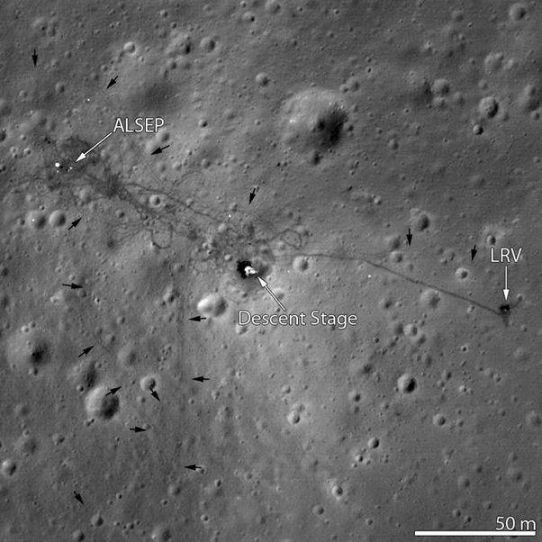
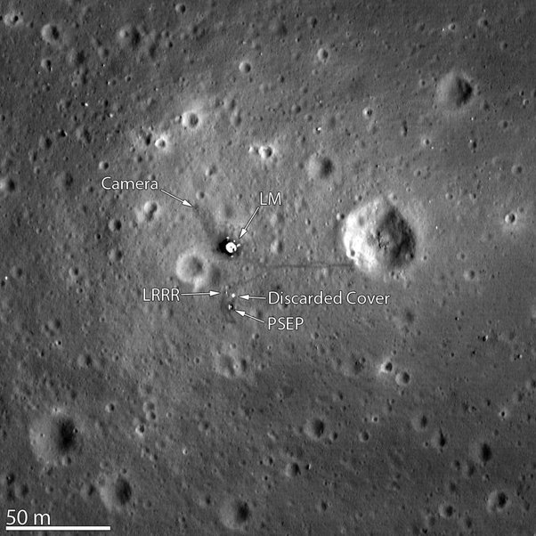
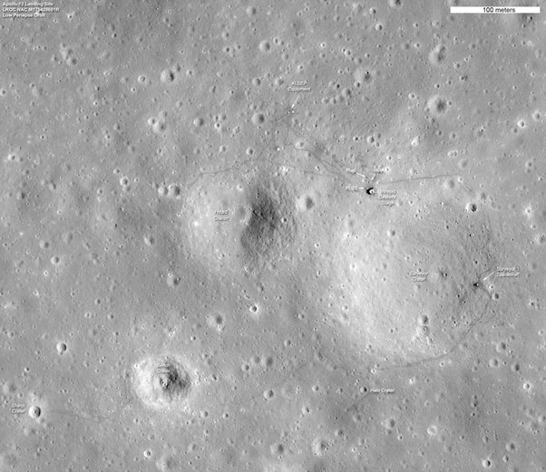

*Réponse publiée [sur Quora](https://fr.quora.com/Avec-les-moyens-actuels-pourquoi-ne-disposons-nous-pas-dimages-pr%C3%A9cises-des-traces-laiss%C3%A9es-sur-la-Lune-par-les-missions-Apollo-rover-lunaires-et-morceaux-de-lem/answer/Dr-Goulu)*

Image du site d'Apollo 15 prise par [Lunar Reconnaissance Orbiter](w:) disponible sur [Apollo 15: Follow the Tracks](https://web.archive.org/web/20200616092932/https://www.nasa.gov/mission_pages/LRO/news/apollo-15.html) : on voit le LEM au centre, le rover LRV à droite et les [Apollo Lunar Surface Experiments Package](w:) en haut à gauche.

LRO a aussi photographié le site d'Apollo 11:

et Apollo 12, ou on voit aussi la sonde [Surveyor 3](w:) à 200m en bas à gauche du LEM , dont les astronautes ont été ramasser des pièces pour pour étudier les effets d'une exposition au long terme à l'environnement lunaire des appareillages humains

[En image : les sites d’atterrissage d’Apollo photographiés par LRO](https://www.futura-sciences.com/sciences/actualites/astronautique-image-sites-atterrissage-apollo-photographies-lro-37349/)
