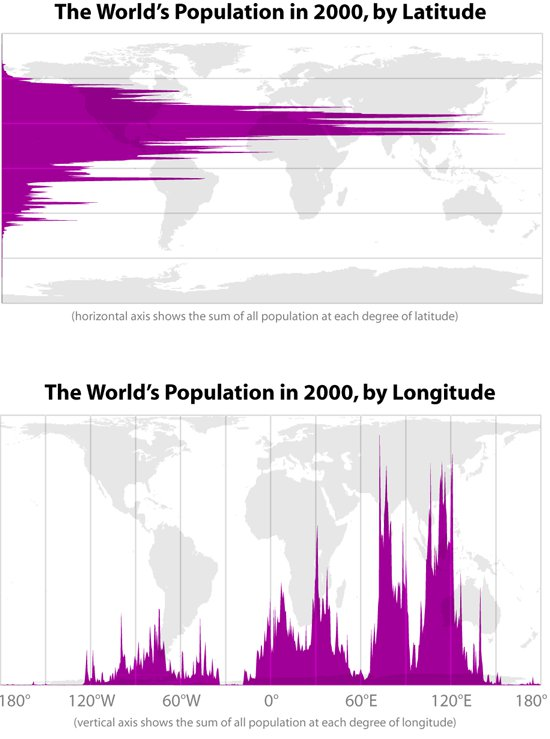

---

title: Avec toute cette pollution, et, entre autres, les calottes glaciaires de Sibérie qui fondent et libèrent du méthane ; a-t-on réellement une chance de survie, même si tous les états décidaient de changer les choses ?
slug: avec-toute-cette-pollution-et-entre-autres-les-calottes-glaciaires-de-siberie-qui-fondent-et-liberent-du-methane-a-t-on-reellement-une-chance-de-survie-meme-si-tous-les-etats-decidaient-de-changer-les-choses
date: '2019-07-20'
draft: false
categories:
- Quora
tags:
- changement-climatique
- environnement
- pollution
- catastrophes-naturelles
- rechauffement-climatique
coverImage: ./images/qimg-23999968fcf6b57fab3754376a1e3fd3.jpg
---

*Article initialement publié sur [Quora](https://fr.quora.com/Avec-toute-cette-pollution-et-entre-autres-les-calottes-glaciaires-de-Sib%C3%A9rie-qui-fondent-et-lib%C3%A8rent-du-m%C3%A9thane-a-t-on-r%C3%A9ellement-une-chance-de-survie-m%C3%AAme-si-tous-les-%C3%A9tats/answer/Dr-Goulu)*

La température moyenne sur Terre est de 15°C. On parle d'un réchauffement de 2 à 6°C, donc d'une moyenne à 21°C max. Est-ce que ça vous ferait mourir ? Probablement pas.

Si vous regardez la densité de la population par latitude, vous voyez qu'il va probablement nous arriver la même chose qu'aux moustiques tigres et aux corail : on va se déplacer.

Ca coûtera très cher, y compris en vies humaines mais nous sommes une espèce très tenace maintenant que nous sommes capables de modifier notre environnement plutôt que de le subir.

Et n'oubliez pas que nous savons comment refroidir le climat si ça devient vraiment trop catastrophique. Il y a 40 ans on avait peur de l'hiver nucléaire…

