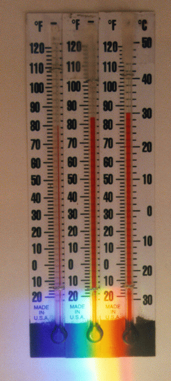
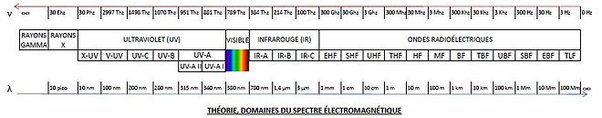

*Article initialement publié sur [Quora](https://fr.quora.com/Comment-connaissons-nous-lexistence-de-la-lumi%C3%A8re-non-visible-si-nous-ne-pouvons-pas-la-voir/answer/Dr-Goulu)*

Excellente question.

En 1800 , [William Herschel](w:) eut l'idée bizarre de placer des thermomètres sur l' "arc en ciel" de la lumière du soleil réfractée par un prisme. Il s'aperçut que le thermomètre placé après le rouge, dans la zone où aucune lumière n'était visible, chauffait aussi. Et même beaucoup, ce qui lui fit baptiser cette lumière invisible "rayons calorifiques". Mais il fallut encore du temps pour qu'on considère que les [Infrarouges](w:Infrarouge) étaient de la lumière.

(Petite expérience sympa à faire en classe: [Herschel Infrared Experiment - an Example](https://web.archive.org/web/20190723124241/http://coolcosmos.ipac.caltech.edu/cosmic_classroom/classroom_activities/herschel_example.html) )

La [découverte des ultraviolets](w:Ultraviolet) a eu lieu l'année suivante, en 1801 quand [Johann Wilhelm Ritter](w:) fit la même expérience avec un papier imbibé de [Chlorure d'argent](w:) qui noircit à la lumière (ce qui permettra de faire des films photographiques) et s'aperçoit que le papier noircit dans la partie invisible à côté du bleu. Il nomme ces rayons invisible "rayonnement oxydant" à cause de leur effet sur des molécules chimiques.

Dès 1830, [Macedonio Melloni](w:) montre que les infrarouges se comportent exactement comme la lumière et [Edmond Becquerel](w:) fait de même pour les ultraviolets en 1842.

Aujourd'hui on sait que la lumière visible ne couvre qu'une toute petite partie du [Spectre électromagnétique](w:) qui va des ondes radio de très basse fréquence jusqu'aux rayons gamma:

En fait ce sont les yeux des êtres vivants qui se sont développés pour capter le rayonnement émis avec la plus forte puissance par notre étoile, avec quelques variations, certains animaux "voyant" l'infrarouge proche, et d'autre les ultraviolets.
