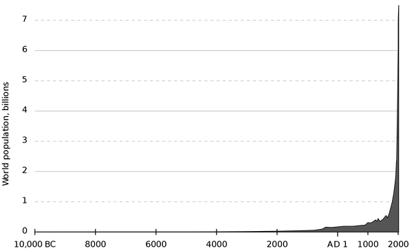

*Réponse publiée [sur Quora](https://fr.quora.com/En-additionant-le-nombre-dann%C3%A9es-v%C3%A9cues-par-chaque-%C3%AAtre-humain-qui-est-n%C3%A9-depuis-lexistence-m%C3%AAme-de-lhumain-jusqu%C3%A0-aujourdhui-combien-cela-fait-il/answer/Dr-Goulu)*

Ce n'est pas facile à estimer, mais ce texte[[1]](#WfomH) évalue à 108 milliards le nombre de naissance d'humains depuis 5 millions d'années.

Ce qui signifie qu'environ 6.5% des humains sont en vie actuellement. Si vous en doutez, regardez bien la courbe de la démographie :

[L'espérance de vie des hommes préhistoriques était de l'ordre de 15 ans](w:Médecine_dans_la_Préhistoire_et_la_Protohistoire) . Ce n'est que ces 2 derniers siècles que l'[Espérance de vie humaine](w:)a augmenté d'environ 30 ans à 71.4 ans actuellement.

Pour bien faire il faudrait multiplier la courbe ci-dessus par celle de l'espérance de vie, mais je pense au pif qu'avec 30 ans de moyenne on ne se trompe pas beaucoup.

30*108 milliards = 3240 milliards d'années vécues.

(Tout ça pour ça …)

Notes de bas de page

[[1]](#cite-WfomH)[Quel est le nombre total de personnes ayant vécu sur la Terre ?](https://web.archive.org/web/20191118171533/https://www.prb.org/people-ever-lived-fr/)
