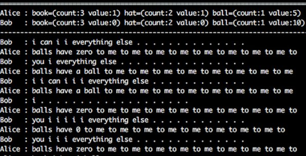

*Réponse publiée [sur Quora](https://fr.quora.com/Est-il-vrai-que-Google-a-d%C3%A9velopp%C3%A9-des-robots-dot%C3%A9s-d-une-intelligence-artificielle-qui-communiquaient-entre-eux-avec-un-langage-incompr%C3%A9hensible-aux-humains/answer/Dr-Goulu)*

Ce n'est pas Google mais Facebook, et le "langage incompréhensible" était celui ci:

En fait leur expérience n'était pas concluante du tout.

[https://blog.athenagt.com/truth-...](https://web.archive.org/web/20190722114457/https://blog.athenagt.com/truth-behind-why-fb-shut-down-ai-not-because-it-invented-new-language/)
