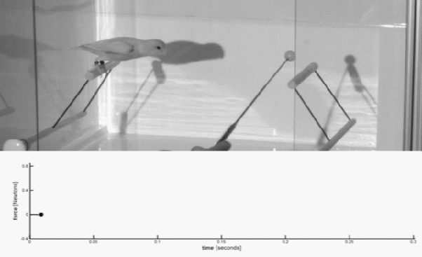

*Réponse publiée [sur Quora](https://fr.quora.com/Imaginer-une-cage-avec-des-oiseaux-sur-une-balance-Lorsque-les-oiseaux-volent-est-ce-que-le-poids-diminue/answer/Dr-Goulu)*

Rien ne vaut l'expérience.

ce que vous voyez sous vos yeux ébahis, c'est que le "poids" ne diminue pas, il augmente !

Du moins à chaque battement d'aile de l'oiseau : pour voler l'oiseau doit pousser de l'air vers le bas, ce qui appuie sur la bas de la cage autant que son propre poids.

**sources**:

- [Est-ce qu’un camion transportant des oiseaux s’allège quand ces derniers prennent leur envol ? - GuruMeditation](https://web.archive.org/web/20210225210603/https://www.gurumed.org/2015/01/17/est-ce-quun-camion-transportant-des-oiseaux-sallge-quand-ces-derniers-prennent-leur-envole/)
- [https://arxiv.org/ftp/arxiv/pape...](https://web.archive.org/web/20200913212533/https://arxiv.org/ftp/arxiv/papers/1409/1409.0304.pdf) .
- video complète:

[https://www.youtube.com/watch?v=...](https://www.youtube.com/watch?v=dpT80Sg19CE)
